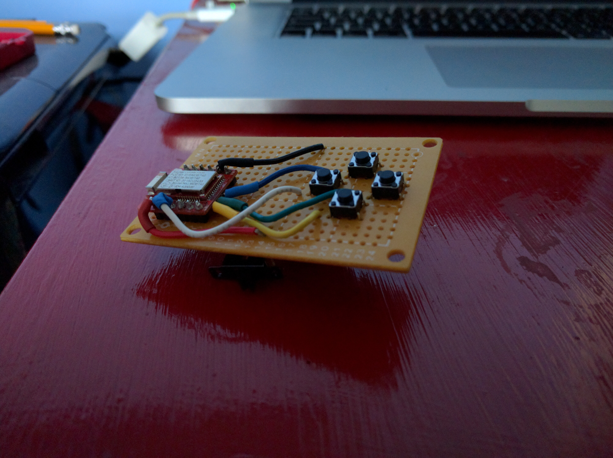

Reveal.js BLE Remote
====================

A simple remote controller for Reveal.js, using Bluetooth Low Energy.

[Reveal.js](https://github.com/hakimel/reveal.js/) is an excellent framework for
creating beautiful presentations using HTML. I use a modified variant (mostly to
use Jade rather than HTML, but also to serve multiple presentations from single
site) of this framework for almost all of my presentations and as such I wanted
a simple remote that could easily move around Reveal.js presentations. Like
Powerpoint, Reveal.js allows movement both left and right, but it also up and
down related slides too.

Why not use a plugin like *remotes*, all ready provided with Reveal.js, that
allows a smartphone to be used as a controller? I had two reasons for not going
down this route; one I often use my phone for other things, e.g. timing and BLE
Eddystone URL Beacon, while giving talks; and two I wanted a simple BLE project
to verify the Bluetooth stack and other software that I'm using in other
research related projects.

Here's a picture of the remote that I built:

To date I have not designed a board, although if I need to build more in the
future  that will be the first port of call. So my current version uses a
protoboard, wires, SPMT switch, and a CR2032 battery with holder; here's a
picture:

Implementation
==============

The current implementation is divided into three components outlined below.

| Component      | Comment |
|----------------|---------|
| ble_remote     | Reveal.js Javascript plugin, using Websocket to receive incoming movement messages. |
| ble_server     | Node.js Typescript Websocket server, that connects to Reveal.js BLE peripheral to receive incomming button presses and translates and forwards them to all listeners. |
| ble_peripheral | Software (mostly written in C) for Reveal.js BLE peripheral based on [Redbear's BLE Nano](http://redbearlab.com/blenano/), which in turn is based on [Nordic's nRF51822 SoC ](https://www.nordicsemi.com/eng/Products/Bluetooth-Smart-Bluetooth-low-energy/nRF51822) solution. |

The first two components can be used as is, however, if you want a physical
remote, then you are going to have to build it! It is actually very
straightforward, but of you have not done any soldering, wiring, before it may
take a little time to get up and running. It is however, an very nice first time
project, that is very forgiving, so don't be put off. Even for the inexperienced
it should not take more than a couple of hours to make.

Installation
============

Installation instructions for each of the components are provided in the respective
directories.

Future Development
==================

A very promising area of development is the [Web Bluetooth
API](https://webbluetoothcg.github.io/web-bluetooth/) being developed to support
BLE directly from within a browser. This would avoid the need, in our current
implementation, to  use a Node.js Websocket server that communicates to the BLE
remote. Instead we could use Web Bluetooth API from the Reveal.js plugin
directly. Sadly at the time of writing Web Bluetooth is only partially
implemented in Chrome, e.g. OS X supported is implemented to no read, and there
is no support in Firefox.

Personally, I feel that Web Bluetooth support in browsers such as Chrome and
Firefox, on all platforms, would really open up BLE application possibilities,
particularly with application to IoT. It would be a really exciting development.

Questions/Comments
==================

Please feel free to contact me with any questions or comments.

License
=======

See LICENSE file.
