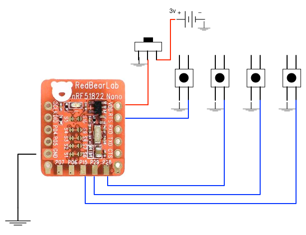

Reveal.js BLE Peripheral
========================

This component provides an implementation of the Reveal.js BLE Remote.
Additionally the Reveal.js BLE peripheral protocol is specified, which can be
used to provide alternative implementations.

Reveal.js BLE Peripheral Protocol
=================================

The remote advertises support for a GATT service using the the Controller
Service UUID specified in the following table with the characteristics specified
in the subsequent table.

| Name	                    | UUID                                 |
|---------------------------|--------------------------------------|
| Controller Service	      | A943A80B-083F-44D3-AED7-1CB57B082F33 |
| Controller Characteristic	| B4FBC6CE-380F-4EC1-BE0A-D163EFCF02C4 |

| Name          | Type | Security     | Properties | Comment       |
|---------------|------|--------------|------------|---------------|
|Controller I/O | blob | Read, Notify | No pairing | No encryption |

A connection interval of 50 - 100ms is deemed suitable.

While in use, a BLE central (see the component *ble_server*) will transfer
Controller data to and from the peripheral via the Controller I/O
characteristic.

The packets sent from the BLE peripheral represent different types of
button presses:

| Button Msg | Comment           |
|------------|-------------------|
| 1          | No button pressed |
| 2          | Left button       |
| 16         | Right button      |
| 8          | Up button         |
| 4          | Down button       |

A button press packet consists of 2 bytes, the first byte is
just a format byte and is currently 0, while the second byte
is one of the five value given in the Button Msg column of the above
table.

The current implementation is based on [Nordic nRF51822 SoC](https://www.nordicsemi.com/eng/Products/Bluetooth-Smart-Bluetooth-low-energy/nRF51822),
using Redbear's Nano BLE:

&nbsp;&nbsp;&nbsp;
[http://redbearlab.com/blenano/](http://redbearlab.com/blenano/)

and is using Nordic's nRF51 SDK, along with FreeRTOS. This component provides
the source code for an implementation of the above BLE service for Redbear's
Nano BLE.

Aside
-----

Clearly, there are many other possible implementations of this service,
however, we have found the Nano to be a cheap and reasonably simple to program
solution. We did find that using either Redbear's Arduino wiring solution or
ARM's MBED to provide disappointing results, although for different reasons.
Redbear's Arduino  solution turned out to be very basic and difficult in the
presence of custom 128-bit UUIDs, necessary for our custom service.
Moreover, as we rely on interrupts for button presses our tests
showed interrupts being missed in some cases! MBED on the other hand does look
promising, however, while impressed with the M0 (and other M-series
MCUs from ARM), we wanted to use FreeRTOS, mostly for practical reasons, to tie
in with other work and not be tied to ARM's MBED system.

Installation
============

As we use FreeRTOS Nordic SDK v11 is required. It is possible another
version of the SDK would work, but I'm not tried it and moreover it
is configured for SoftDevice S130, which requires a later SDK.

Nordic SDK v11 can be downloaded from:

&nbsp;&nbsp;&nbsp; [https://developer.nordicsemi.com/nRF5_SDK/nRF5_SDK_v11.x.x/](https://developer.nordicsemi.com/nRF5_SDK/nRF5_SDK_v11.x.x/)

Install this in the directory:

    nRF51822_SDK

You should have the directory structure:

    nRF51822_SDK
        v11

You will also need to install *mergehex* tool from the Nordic website:

&nbsp;&nbsp;&nbsp; [https://www.nordicsemi.com/eng/Products/Bluetooth-Smart-Bluetooth-low-energy/nRF51822#Downloads](https://www.nordicsemi.com/eng/Products/Bluetooth-Smart-Bluetooth-low-energy/nRF51822#Downloads)

Install in the directory *mergehex* under the Nordic SDK root directory. You should now have the directory structure:

    nRF51822_SDK
        mergehex
        v11

The makefile in this component requires the environment variable:

    NORDIC_SDK_PATH

to be set to point to the Nordic SDK's root directory, looking something like:

    export NORDIC_SDK_PATH=<your-path-to-dir>/nRF51822_SDK/v11

For the Nordic SDK to work correctly you need to install a GCC variant for
ARM's M-series. There are different versions of GCC that can be used, for
example 4.9 is the one recommended by Nordic. For our use we choose to use
the latest version released by ARM (5.3 at time of writing) as for other
projects involving M-series processors certain C++17 features where required
and support prior to 5.3 is not as robust, and additionally. The latest
ARM provided releases can be found here:

&nbsp;&nbsp;&nbsp;
[GCC Arm Embedded](https://launchpad.net/gcc-arm-embedded)

Once installed you need to update the the makefile for your system in the
Nordic SDK to point to the installed ARM toolchain. For example, on OS X I
edited the file:

   $(NORDIC_SDK_PATH)/components/toolchain/gcc/Makefile.posix

There is a similar makefile for Windows and so on.

Finally, I found that I could not get the simply Blinky app working with the
firmware that came with the Redbear Nano and to fix this I needed to upgrade
to the version provided on ARM's MBED site for the Nano. You can download from
here:

&nbsp;&nbsp;&nbsp;
[blenano_mk20dx_interface_20140912.bin](https://developer.mbed.org/media/uploads/RedBearLab/blenano_mk20dx_interface_20140912.bin)

To upgrade the interface firmware (inside the MK20 chip):

1. Press and hold the reset button on the MK20 USB board
2. Connect it to an USB port of your PC
3. "BOOTLOADER" drive will be shown
4. Release the button and the LED will keep flashing (slowly)
5. For Windows, just drag the new firmware to the MSD drive
6. For Linux or Mac OSX, use the follow command from the Terminal:

    dd if=src_firmware.bin of=/Volumes/BOOTLOADER/dst_firmware.bin conv=notrunc

7. The LED should keep flashing (very fast this time)
8. Remove the board from the USB port
9. Reconnect it to the USB port

You can test that this has all worked correctly by uploading the Blink example
from the MBED site:

&nbsp;&nbsp;&nbsp;
[blenano_mk20dx_interface_20140912.bin](https://developer.mbed.org/media/uploads/RedBearLab/blenano_mk20dx_interface_20140912.bin)

You can now test your BLE Nano by performing the steps:
1. Mount your BLE Nano onto the MK20 USB dongle correctly.
2. Connect the MK20 USB dongle to your host PC. The PC will prompt that
   a new disk named "MBED".
3. Open the MBED disk. Drag and drop the Blinky file downloaded above.
4. You should see the LED on the BLE Nano start blinking.

Assuming this all worked OK, you should now be able to build and upload the
BLE peripheral remote for Reveal.js found in this component.

Nano Wiring
===========

The wiring for the Nano is very straightforward, after all we only have 4
buttons, and to make life super easy we use the pullups within the nRf51
itself and so really not much to do. Moreover, the choice of which pins to
use is (mostly) random and assuming you change the source code to match can
select pins that suit your needs.

The following picture shows how I wired mine:



If you choose a different wiring, then you should edit (*main.c*)
the #defines:

```c
#define BUTTON_UP      29
#define BUTTON_DOWN    28
#define BUTTON_LEFT    15
#define BUTTON_RIGHT   10
```

Nothing else should need to change.

Building
========

Running
=======

License
=======

See LICENSE file.
